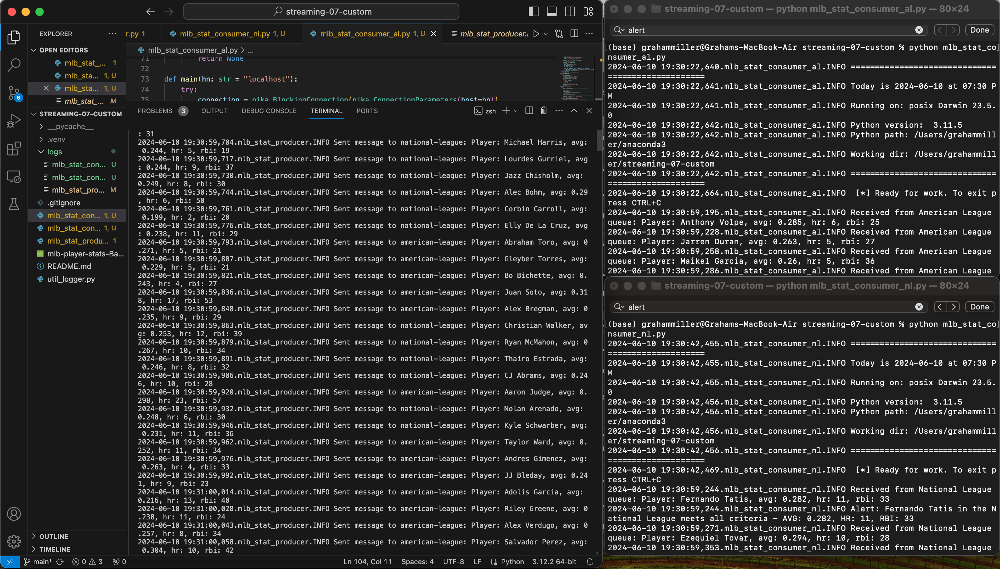
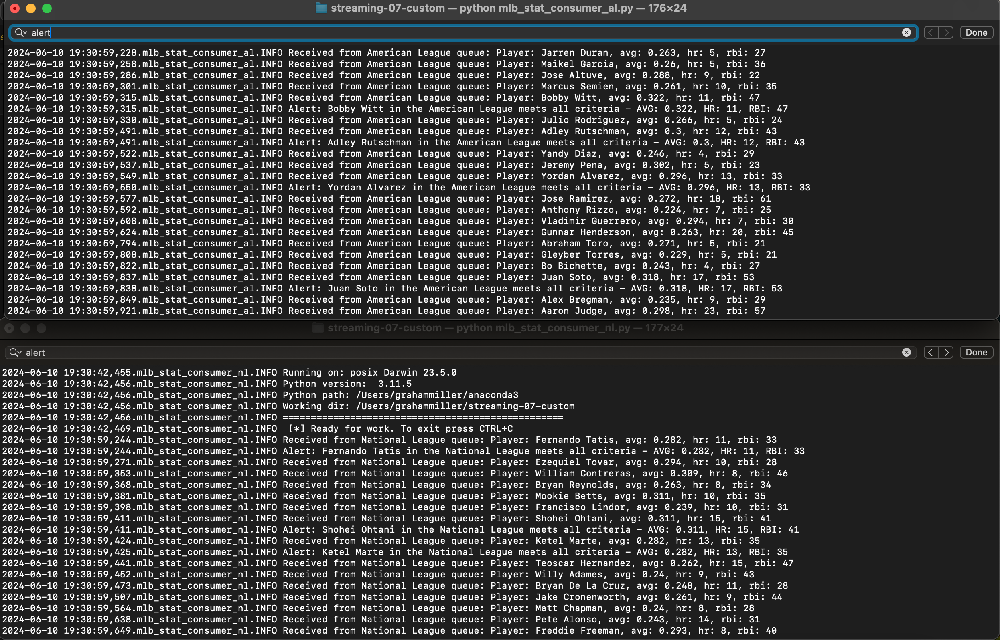

# streaming-07-custom

### Graham Miller
### Date: 06/10/2024

## Project Goal
The objective of this project is to develop a producer that sorts Major League Baseball (MLB) player statistics based on the league they play in and sneds the statistics to corresponding queues for further processing. This involves a producer that sorts player stats into either the National or American League based on the league the player is in and sends these stats to the appropriate queue. Each league has its own consumer that processes the player statistics from the queue and triggers an alert when a player meets 3 specific performance thresholds.

The key offensive statistics being monitored are batting average, home runs, and runs batted in (RBIs). The thresholds for these statistics are set as follows:

Batting Average: .280
Home Runs: 10
Runs Batted In (RBIs): 30
These thresholds were chosen because they highlight players who are excelling in three of the most important offensive metrics. Players who meet or exceed these thresholds are considered to be among the top offensive performers in the 2024 season.

### Requirements
- RabbitMQ Server Running
- Pika installed in the .venv
- MLB Player Stats CSV loaded to the repository

## Task 1. Create a Workspace
1. Create a new repository for the project.
1. Add a README.md during the creation process.
1. Clone the repository to your machine.
1. In VS Code, add a .gitignore from a previous module.
1. Add util_logger.py to the repository
1. Add mlb-player-stats-Batters.csv to the repository.
1. Create a file for the mlb stat producer. 
1. Create a new virtual environment using: 
```shell
python3 -m venv .venv
```
1. Activate the virtual environment
```shell
source .venv/bin/activate
```
1. Install pika into the virtual environemtn
```shell
pip install pika
```

## Task 2. Design and Implement The Producer
- Design the producer to offer the RabbitMQ Admin website.
- Define which teams are in the American League and which are in the National League
- Create a connection to the RabbitMQ server.
- Write the csv processing so that it extracts the player name, team name, player batting average, player home runs, and player runs batted in from the csv.
- Implement logic that sorts player stats between queues based on what team they play for. 
- Implement logic that checks to make sure that the strings are not empty. 
- Define the function to send the message to the specified queue. 
- Add a conditional statement to ensure that the code is executed directly

## Task 3. Design and Implement the Consumer
- Design two consumers, one to receive messages from the National League queues, and one to receive messages from the American League queue. 
- Define the function to process the messages received from the queue.
- Add thresholds to Batting Average, Home Runs, and Runs Batted In to identify players that meet all 3 thresholds. 
- Create a function that parses the message received from the queue in the expected format. 
- Define a function that connects to the RabbitMQ server, declares the desired queue (National Leage/American League), and consumes messages from the specified queue. 
- Add conditional statement to ensure that the code is executed directly. 

## Task 4. Execute both Consumers, then Execute the Producer
- First open 2 mac terminals.
- Use `cd /Users/grahammiller/streaming-07-custom`, or wherever your consumer is located on your machine
- run `ls` to see a list of the files in this folder
- run `conda activate base` to activate the base environment
- run code `python mlb_stat_consumer_nl.py`, or whatever your first consumer/worker is named in the first terminal.
- run code `python mlb_stat_consumer_al.py`, or whatever your second consumer/worker is named in the second terminal.
- Once both are ready for work, execute the producer
- Open a terminal in the VS Code project repository and run `python mlb_stat_producer.py` to send tasks to the RabbitMQ queue.

## Screenshot showing Producer and Consumers running concurrently



## Screenshot showing Consumer Alerts for players meeting the threshold for all 3 statistical categories



